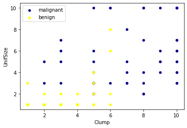
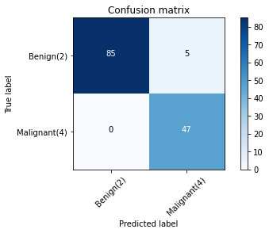

# Cancer-Cell-Detection-SVM

## Table of contents

- [Objective](#Objective)
- [Technologies](#technologies)
- [Description](#project-description)
- [Results](#project-results)

## Objective
[(Back to top)](#Table-of-contents)

In this notebook, I  will use SVM (Support Vector Machines) to build and train a model using human cell records, and classify cells to whether the samples are benign or malignant.
SVM works by mapping data to a high-dimensional feature space so that data points can be categorized, even when the data are not otherwise linearly separable. A separator between the categories is found, then the data is transformed in such a way that the separator could be drawn as a hyperplane. Following this, characteristics of new data can be used to predict the group to which a new record should belong.

## Technologies
[(Back to top)](#Table-of-contents)

## Description
[(Back to top)](#Table-of-contents)
+ ### Data Analysis 

    #### Dataset
    The example is based on a dataset that is publicly available from the UCI Machine Learning Repository (Asuncion and Newman, 2007)[http://mlearn.ics.uci.edu/MLRepository.html]. The dataset consists of several hundred human cell sample records, each of which contains the values of a set of cell characteristics. The fields in each record are:

    | Field name  | Description                 |
    | ----------- | --------------------------- |
    | ID          | Clump thickness             |
    | Clump       | Clump thickness             |
    | UnifSize    | Uniformity of cell size     |
    | UnifShape   | Uniformity of cell shape    |
    | MargAdh     | Marginal adhesion           |
    | SingEpiSize | Single epithelial cell size |
    | BareNuc     | Bare nuclei                 |
    | BlandChrom  | Bland chromatin             |
    | NormNucl    | Normal nucleoli             |
    | Mit         | Mitoses                     |
    | Class       | Benign or malignant         |
    For the purposes of this project , we're using a        dataset that has a relatively small number of predictors in each record. 

+ ### Data Visualization

+ ### Data pre-Processing & Modeling
        X_train, X_test, y_train, y_test = train_test_split( X, y, test_size=0.2, random_state=4)
        print ('Train set:', X_train.shape,  y_train.shape)
        print ('Test set:', X_test.shape,  y_test.shape)
*  ### Evaluation & Tweaking 
        from sklearn import svm
        clf = svm.SVC(kernel='rbf')
        clf.fit(X_train, y_train) 
    SVM with Linear Kernel :

        clf2 = svm.SVC(kernel='linear')
        clf2.fit(X_train, y_train) 
        yhat2 = clf2.predict(X_test)

    SVM with poly Kernel :

        clf2 = svm.SVC(kernel='poly')
        clf2.fit(X_train, y_train) 
* ## Results
    Confusion Matrix of Default Model:
    
    
    | Model     | Metrics                       |
    |-------    |---------                      |
    |Default SVM|Avg F1-score:0.9639038982104676 Jaccard score:0.9444444444444444                            |
    | SVM with Linear Kernel | Avg F1-score: 0.9639  Jaccard score: 0. 9444                            |         
    | SVM with Poly  Kernel | Avg F1-score:  0.9711   Jaccard score: 0.9556                             |  
    | SVM with Sigmoid  Kernel | Avg F1-score: 0.3715  Jaccard score: 0.3942|    

### Polynomial kernel give us the best accuracy score     

